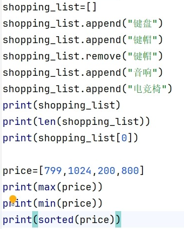
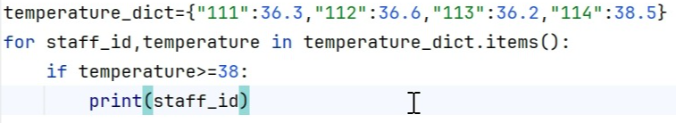
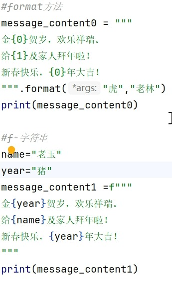
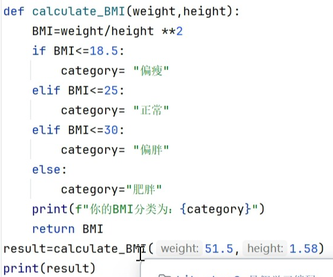
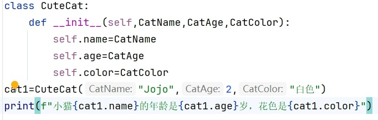
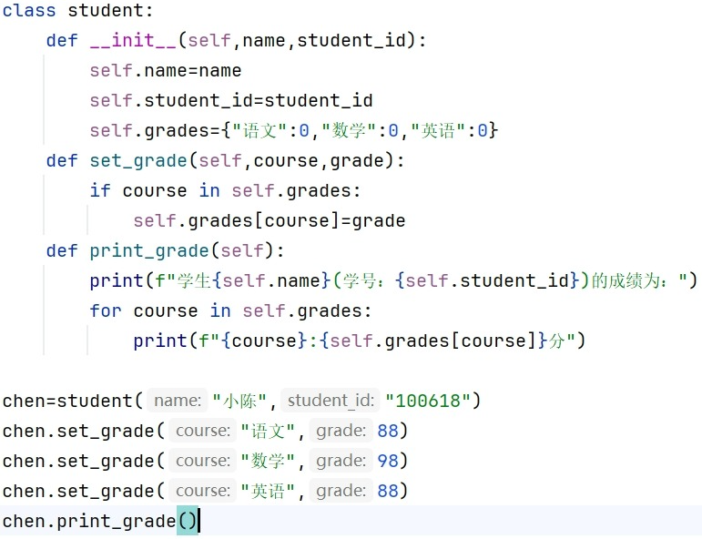
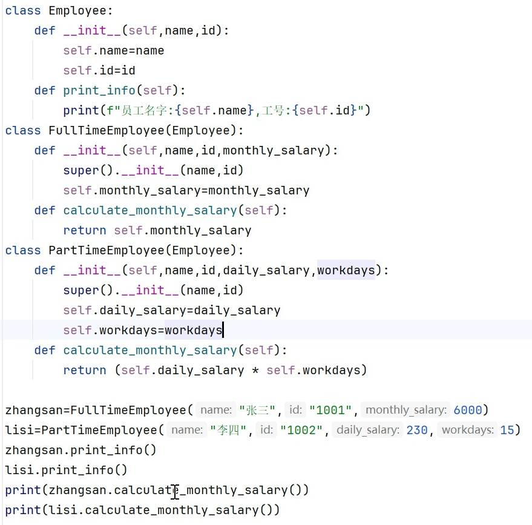

# 学习记录  
### 记录人：  
**邹晓南**  
### 学习日期：  
**7.16**  
### 学习内容：  
- [x] **Python基础知识**    

## 一、学习过程  
### 1.1数学运算  
**1.1.1使用运算库**  
```  
import math  
math.sqrt(x)   
```  
**1.1.2平方**  
`x ** 2`  
### 1.2注释  
1. 单行 `#`  
2. 多行 
``` 
"""       """ 
``` 
3.多个单行注释：`ctrl+/`    

### 1.3  input()函数  
input函数可以获取用户输入的值，但是其类型为字符串类型，若要进行运算，需要类型转换   

### 1.4 print()函数  
print函数必须是要字符串类型  

### 1.5 if语句用法  
1. if 后接的条件不需要打括号但是要有冒号  
2. 同时也不用打`{}` ，按照缩进来区分  
3. 多的条件判断的关键词是`elif`    
4. 
### 1.6 逻辑运算符  
1. `10 <= x <= 100`是正确的  
2. 与`and`  
   或`or`  
   非`not`  
3. 优先级：`not > and >  or`    
4. 
### 1.7列表，字典，元组  
**1.7.1  列表**  
示例：
``` shoppping_list=[]  
shopping_list.append("键盘")  
shopping_list.remove("键盘")  
len(shopping_list)  
```  
**1.7.2  字典**  
key :  value  
1. 示例：
   ```   
   contacts ={"小明":"13700000000","小花":"13700000001"}  
   ```  
2. 查询  
`contacts["小明"]`    
1. 添加  
`contacts[A]="18600000000"`    
1. 判断该键是否存在  
`"小明" in contacts`    
1. 删除  
`del contacts["小明"]`  
1. 字典中的键值对个数  
`len(contacts)`

*字典中的key不能是列表，若要用列表，则使用元组*  
**1.7.3 元组**  
示例：  
```
contacts = {("张伟",23):"15000000000",("张伟",34):"15000000001",("张伟",56):"15000000002"}
```  

### 1.8 循环  
1. 字典名.keys() 所有键  
字典名.values()  所有值  
字典名.items() 所有键值对    
2.  `for 变量名 in 可迭代对象`  
3. `range(起始值,结束值,步长)` 表示整数序列，但不包括结束值，当不写步长时，其步长默认为1  

### 1.9 格式化字符串  
1. format方法  
2. f-字符串  

### 1.10 类  
1.类的创建  
2. 类的继承  

### 1.11 文件  
**1.11.1打开文件**  
`open("绝对路径/相对路径","r",encoding="utf-8")`  
**1.11.2读文件**  
1. read 返回全部内容的字符串  
2. readline 返回一行文件内容的字符串  
3. readlines 返回全部文件内容组成的列表   

**1.11.3关闭文件**  
``` 
f=open("./data.txt")  
print(f.read())  
f.close()  
```      
或者
```
with open("./data.txt")  
print(f.read)
```   
**1.11.4写文件**  
1. `w`模式：清空重写  
2. `a`模式：附加内容  

### 1.12 异常处理  
```
try 接 可能报错的程序    
except+(出错类型) 输出问题
```    
### 1.13 高阶和匿名函数  
**1.13.1 高阶函数**  
参数中有函数名的函数  
**1.13.2 匿名函数**  
示例：  
`(lambda num1 num2: num1+num2)(2,3)`  
冒号后面只能接单个表达式或语句，只使用简单场景  

## 二、实操  
### 2.1列表  

### 2.2 字典&元组  

 
### 2.3 格式化字符串  

### 2.4 函数  

### 2.5 类  
**2.5.1 类的创建**  


**2.5.2 类的继承**  


## 遇到的问题及解决方法  
### 类继承传参报错：  
super()调用删掉self，匹配父类参数个数  


